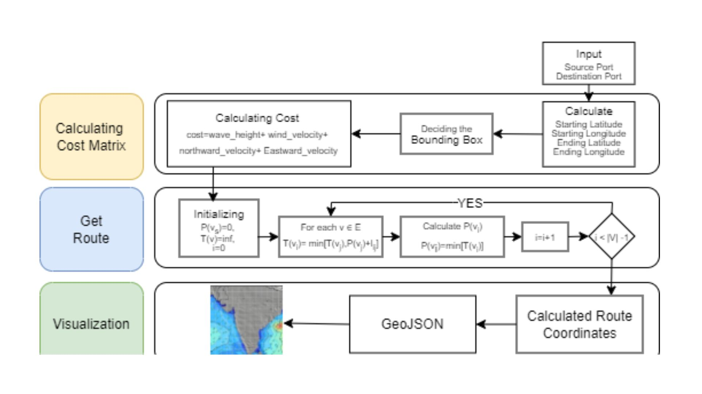

# SSRS - Ship Safety And Routeing System

<br/>

<p align="center">
  
</p>

<p align="center">
  Ship Routing Algorithm to Minimize Fuel consumption and CO2 emission
  <br />
  <br />
  <a href="#table-of-contents"><b>Explore the docs »</b></a>
  <br />
  <br />
  <a href="#architecture-and-design">Architecture</a>
  &nbsp;&nbsp;·&nbsp;&nbsp;
  <a href="#demonstration">Features</a>
  &nbsp;&nbsp;·&nbsp;&nbsp;
  <a href="#contributing">Local Setup</a>
  <br />
</p>

## Table Of Contents

- [About the Project](#about-the-project)
- [Architecture](#architecture)
- [Architecture](#architecture)
- [Technical Approach](#technical-approach)
- [Impacts And Benefits](#impacts-and-benefits)
- [Technologies Used](#technologies-used)
- [Contributing](#contributing)
- [Authors](#authors)

## About The Project

Development of a versatile algorithm for optimal ship routing in the Indian Ocean, optimizing for fuel consumption, voyage time, safety, and other parameters, using real-time weather data and ship characteristics, with potential to expand optimization features

- Optimizing a ship's route and speed can reduce CO2 emissions by up to 48–60% and can save billions of dollars.
- Our algorithm utilizes the CMEMS(ocean dataset) and INCOIS(Indian ocean data) ocean dataset for getting precise marine information and ocean conditions along with the accurate International Ports data after consulting with experienced marine officers.
- The application allows ship captains to adjust routes based on cost or fuel optimization for a customized path. 
- Our solution's algorithm self-improves using past ship incidents, becoming smarter in suggesting the most efficient routes.
<br />

**Features of our Solution**

1. Creating a custom algorithm considering a combination of nsga2, pso, dijkstra and cost matrix

2. Offers a desktop app via ElectronJS with both online and offline route-finding, and a website with online capabilities.

3. SOS feature in the application for a ship in isolation or danger (oil spills,crash etc).

4. Nearby port visiblity & route re-configuration  for emergency stop, refueling at bunkering station.

5. Provides radar visibility and communication, even via radio during internet outages, for urgent ship needs and supply requests.
<br />

## Architecture


<br />

## Technical Approach

- Step 1: Input Coordinates (starting/ending latitudes and longitudes).

- Step 2: Define Bounding Box around the coordinates.

- Step 3: Calculate Travel Costs using environmental factors (wave height, wind, velocity, shallow patches, water depth, etc).

- Step 4: Initialize Costs for the starting node and set tentative distances for others.

- Step 5: Iterate over nodes, updating the cost matrix and calculating the shortest path.

- Step 6: Determine the Optimal Route based on the minimum cost calculated.

- Step 7: Now these Coordinates are then passed through GeoJSON to visualize it on the map.

- Step 8: Now the user can choose route on the basis of fuel consumption and time required.

<br />

## Impcats and Benefits

**Potential Impact on the Stakeholders:**

1. Shipping Companies: Significant cost savings through optimized fuel-efficient routes and real-time data to avoid delays, improving overall efficiency and safety.

2. Ship Crew: Immediate assistance can be received from nearby ships through a radar system, improving emergency safety.

3. Logistics Companies: Supply chain optimization with real-time updates, ensuring better reliability in delivery schedules and reducing disruptions.

4. Port Authorities: Improved traffic management by providing visibility of incoming ships and reducing port congestion through efficient scheduling.

5. Maritime Insurers: Enhanced risk assessment using real-time and historical data, reducing incidents with SOS features and live ship tracking.

**Benefits of the Solution:**

1. Environmental: The solution promotes lower carbon emissions by steering ships through more fuel-efficient routes and avoiding ecologically sensitive areas, contributing to sustainable maritime operations. 

2. Resource Management: Nearby port visibility allows efficient refueling and docking, minimizing unnecessary stops and optimizing operational time.

3. Safety and Risk Mitigation: Live SOS alerts and weather data enhance crew safety, helping ships avoid dangerous conditions and receive quick assistance.

4. Operational Efficiency: Real-time ocean data ensures optimal routing and minimizes delays, while customizable routes improve flexibility for different vessel types.

<br />

## Demonstration

[Watch the video on YouTube](https://www.youtube.com/watch?v=k4cO_Zhvkqg)

<br />

### Technologies Used

- Frontend
  - React 
  - CSS
- Backend
  - Flask
  - Computer Vision

<br />

## Contributing

**Local Setup || Project Structure**

NOTE: Individual instructions can be found in respective directories.

- The project contains 4 broad directories.

```
*
├───client
├───data
├───processing
└───server
```

- `client`: The frontend for the application.
- `data`: The dataset for the applications.
- `processing`: Processing on the dataset
- `server`: The backend for the application.

<br />

**Client**

For local setup of frontend:

- `cd client`
- `npm i`
- `npm run dev`

Structure

```
src
├───assets
├───components
├───Pages
├───App.jsx
└───main.jsx
```

Individual Component & Pages Structure

```
component
├───component.jsx
└───component.css
```

```
pages
├───page.jsx
└───page.css
```

<br />

**Server**

For local setup of backend:

- `cd server`
- `python app.py`

```
server
└───app.py
```

<br />

## Authors

- Hamza Sayyed
- Om Shete
- Mohib Abbas Sayed
- Parth Puranik
- Vedant Borkar
- Nikshita Karkera

## License 📜

[GPU License](https://github.com/Hamzawp/Sattvik/blob/main/LICENSE.txt)
